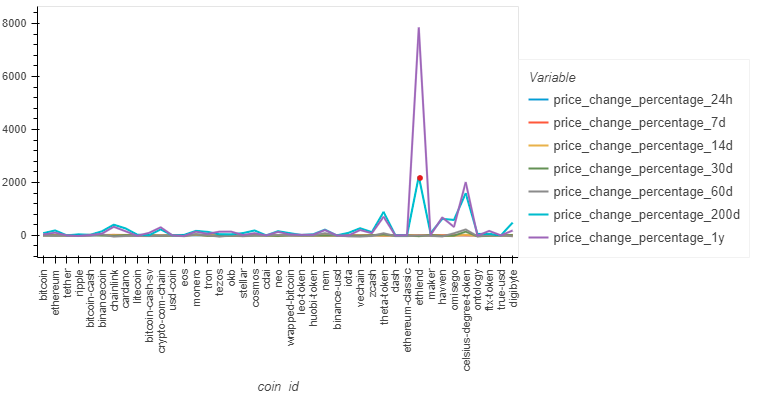

# CryptoClustering

## Description
This project's goal is to predict the influence of 24-hour or 7-day price changes on cryptocurrencies using Python and an unsupervised learning technique - clustering algorithm.

## Libraries Used
- pandas (data manipulation)
- hvplot (interactive plotting)
- scikit-learn (unsupervised learning)

## File Structure
- 'Crypto_Clustering.ipynb': Jupyter Notebook with python script that uncovers trends in *Resources/crypto_market_data.csv*. 
- 'Resources/crypto_market_data.csv': CSV file with raw data that includes information as:
    - coin_id,
    - price_change_percentage_24h,
    - price_change_percentage_7d,
    - price_change_percentage_14d,
    - price_change_percentage_30d,
    - price_change_percentage_60d,
    - price_change_percentage_200d,
    - price_change_percentage_1y

## Data Preparation and Cluster Analysis
### Preparation steps:
Before conducting the analysis data was scaled using StandardScaler.

The analysis was performed on the original scaled data, as well as the optimized dataset, where a PCA was performed to reduce the features of the original DataFrame to 3 principal components with the total explained variance of 89%.

### Steps to cluster the cryptocurrenscies on both DataFrames (original scaled and optimized):
- Applying elbow method to find the best number of clusters (k value)

for original DataFrame

and optimized

- Using the best identified k value fit the K-means model.

- Predicting the clusters to group the cryptocurrencies.
- Visualizing the results using a scatter plot for both 

for original DataFrame

and optimized

## Results

It appears that the optimal number of cryptocurrency clusters suggested based on the analysis of the original DataFrame with all of the factors is the same as using optimization techniques(PCA), and equals to 4. 

However, using PCA, cluster that contains only 1 cryptocurrency - celcius-degree-token - outlines visually more clear than based on the original analysis, but overall scatter plot built based on the PCA results shows that data points are tigher clustered together than data points in the original dataset. 